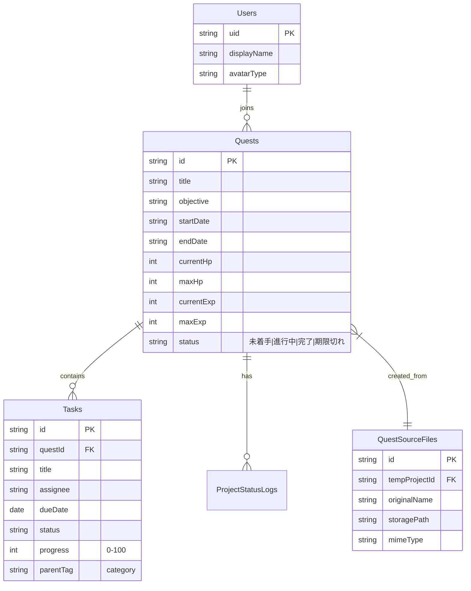

# データ設計 (Schema Design)

## 1. データベース概要 (Firestore)
本システムでは NoSQL データベースである **Google Cloud Firestore** を使用します。
RDBのような固定スキーマではありませんが、アプリケーションコード（TypeScript）で型定義を厳格に管理することで整合性を保ちます。

### ER図 (Conceptual)

---

## 2. コレクション詳細設計

### `quests` Collection
プロジェクト（クエスト）の基本情報を管理するルートコレクション。

| Field Name | Type | Required | Default | Description |
| :--- | :--- | :--- | :--- | :--- |
| `id` | string | Yes | (Auto) | Document ID |
| `title` | string | Yes | - | クエスト名（プロジェクト名） |
| `objective` | string | Yes | - | 目的・ゴール |
| `recommendedLevel` | number | Yes | 1 | 推奨レベル（難易度） |
| `elapsedDays` | number | Yes | 0 | 経過日数（開戦からの日数） |
| `status` | string | Yes | "未着手" | ステータス |
| `metrics` | map | Yes | {} | { agi, hp, exp } の現在値 |
| `debuffs` | array | No | [] | 現在発生中のデバフ一覧 |
| `guildMasterComment` | string | No | "" | 最新のギルドマスターコメント |

### `quests/{questId}/tasks` Sub-collection
クエストに紐づくタスク（敵・障害）を管理。

| Field Name | Type | Required | Default | Description |
| :--- | :--- | :--- | :--- | :--- |
| `id` | string | Yes | (Auto) | Task ID |
| `title` | string | Yes | - | タスク名 |
| `owner` | string | No | "未定" | 担当者名 |
| `due` | string | Yes | - | 期限 (YYYY-MM-DD) |
| `status` | string | Yes | "未着手" | ステータス |
| `progress` | number | Yes | 0 | 進捗率 (0-100) |
| `parentId` | string | Yes | "default" | ガントチャート上のグループID |
| `parentLabel` | string | Yes | - | グループ表示名 |

### `questSourceFiles` Collection
WBS生成のために一時的または永続的にアップロードされたソースファイル情報。

| Field Name | Type | Required | Default | Description |
| :--- | :--- | :--- | :--- | :--- |
| `tempProjectId` | string | Yes | - | 生成フロー用の一時ID |
| `originalName` | string | Yes | - | 元ファイル名 |
| `path` | string | Yes | - | GCS上のパス |
| `type` | string | Yes | - | MIME Type |
| `uploadedAt` | timestamp | Yes | serverTime| アップロード日時 |

---
