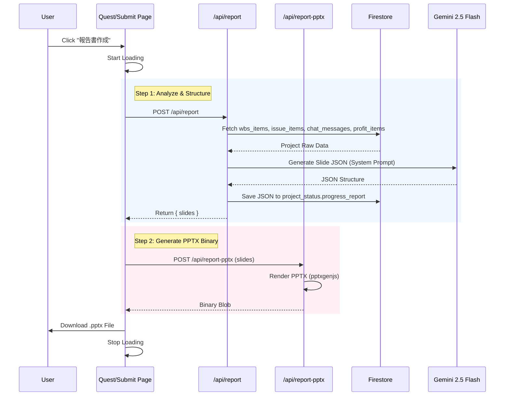

# 詳細設計書 (Detailed Design Document)

## 1. 詳細設計書構成

### 表紙
*   **システム名**: Project Quest (AI-Hackathon-2025)
*   **詳細設計書の作成日**: 2026-01-21
*   **バージョン**: 2.0.0 (Source Code Generation Ready)
*   **作成者**: AI Assistant (Antigravity)

### 目次
1.  詳細設計書構成
2.  システム概要
3.  モジュール設計
    *   3.1 モジュール一覧
    *   3.2 モジュール詳細
    *   3.3 AI・LLM実装設計
    *   3.4 フロントエンド設計方針
    *   3.5 AI評議会 設計思想 (The Council Room Philosophy)

## 4. データ設計

### 4.1 データ構造 (Object Models)

#### Firestore Document Interfaces

**1. Quest (Collection: `quests`)**
```typescript
interface QuestData {
  /** Document ID: (e.g. "core-system") */
  id: string;
  /** プロジェクト名 */
  title: string;
  /** 進捗状況 (0-100) - AGI */
  progress: number;
  /** 予算消化状況 (0-100) - HP */
  budgetConsumption: number;
  /** クエストステータス */
  status: "normal" | "caution" | "danger";
  /** 各種メトリクス (Report用) */
  metrics?: {
    agi: number; // 進捗
    hp: number;  // 予算
    exp: number; // タスク完了数
  };
}
```

**2. WBS Item (Collection: `wbs_items`)**
```typescript
interface WbsItem {
  /** プロジェクトID (Foreign Key) */
  projectId: string;
  /** No (Excel由来) */
  number: string | number;
  /** サブシステム名 */
  subSystem: string;
  /** 機能分類 */
  category: string;
  /** 機能名 */
  feature: string;
  /** ステータス ("未着手", "進行中", "完了", "遅延" etc.) */
  status: string;
  /** 進捗率 (文字列 or 数値) */
  progress_ratio: string;
  /** 担当者名 */
  assignee: string;
  /** 予定開始日 (Firestore Timestamp) */
  plan_start_date: any; 
  /** 予定終了日 (Firestore Timestamp) */
  plan_end_date: any;
  /** 実績終了日 (Firestore Timestamp) */
  actual_end_date: any;
  /** インポート元ファイル名 */
  source_file_name: string;
  /** インポート日時 */
  imported_at: any;
}
```

**3. Council Log (For API & Frontend State)**
```typescript
interface CouncilLog {
  speakerId: "pmo" | "manager" | "sales" | "super_pm" | "user" | "cto" | "ux" | "sre" | "genba";
  /** キャラクター表示名 */
  name?: string;
  /** 発言内容 */
  message: string;
  /** アクション案（要約） */
  actionPlan?: string;
  /** アイコン画像のパス (Optional) */
  icon?: string;
  /** ユーザーに採用されたかどうか */
  adopted?: boolean;
}
```

### 4.2 データベース設計 (Firestore Schema)

| Collection Name | Doc ID Rule | Description |
| :--- | :--- | :--- |
| **`quests`** | User-defined (Slug) | プロジェクトの基本情報。ダッシュボード表示用。 |
| **`wbs_items`** | Auto-generated | WBSの各タスク行。`projectId` でクエリする。 |
| **`chat_messages`** | Auto-generated | Teams等のチャットログ。分析用ソース。 |
| **`issue_items`** | Auto-generated | Redmine等の課題チケット。 |
| **`profit_items`** | Auto-generated | 予算・採算管理データ。 |
| **`project_status`** | Auto-generated | プロジェクトの要約、進捗率、AI生成報告書(`progress_report`)。 |

---

## 5. インターフェース設計

### 5.1 外部インターフェース (API Routes)

#### 1. Council Meeting API
*   **Endpoint**: `POST /api/council-meeting`
*   **Request Body**:
    ```typescript
    interface CouncilReqBody {
      questTitle: string;
      status: string; // e.g. "Alert"
      metrics: { key: string; label: string; value: number }[];
      topic?: string; // ユーザーからの議題/質問
      history?: CouncilLog[]; // 直近の会話履歴
    }
    ```
*   **Response Body**:
    ```typescript
    // Array of new logs generated by AI
    type CouncilResBody = CouncilLog[];
    ```

#### 2. Report JSON Generation API
*   **Endpoint**: `POST /api/report`
*   **Summary**: WBS/Issue/Chat/Budgetデータを分析し、PPTX用JSONを生成。同時に `project_status` に保存する。
*   **Request Body**:
    ```typescript
    interface ReportReqBody {
      projectId: string; // 対象クエストID
      note?: string;     // ユーザーメモ
    }
    ```
*   **Response Body**:
    ```typescript
    interface ReportResBody {
      projectId: string;
      slides: any[]; // Slide JSON structure for PPTXGenJS
    }
    ```

#### 3. Council Report Discussion API
*   **Endpoint**: `POST /api/council-report-discussion`
*   **Summary**: 保存済みの `progress_report` を読み込み、AI評議会が議論と想定QAを生成する。
*   **Request Body**: `{ projectId: string }`
*   **Response Body**:
    ```typescript
    interface CouncilReportResBody {
      discussion: CouncilLog[];
      qa: { question: string, answer: string, askedBy: string }[];
    }
    ```

#### 4. PPTX Binary API
*   **Endpoint**: `POST /api/report-pptx`
*   **Request Body**:
    ```typescript
    interface PptxReqBody {
      projectId: string;
      slides: any[]; // JSON generated by /api/report
    }
    ```
*   **Response**: Binary Blob (`application/vnd.openxmlformats-officedocument.presentationml.presentation`)

---

## 6. 処理フロー

### 6.1 Report Generation Flow (Sequence Diagram)



### 6.2 Import Logic Flow (Pseudocode)

**Target**: `app/quest/submit/page.tsx` -> `handleSubmit()`

```typescript
function handleSubmit():
  if selectedFiles is empty:
    return Error("No file selected")

  for file in selectedFiles:
    // 1. Read & Parse Excel
    buffer = await file.arrayBuffer()
    workbook = XLSX.read(buffer)
    sheetName = workbook.SheetNames[0]
    rawData = XLSX.utils.sheet_to_json(workbook.Sheets[sheetName])
    
    // 2. Identify Collection by Headers
    headers = Object.keys(rawData[0])
    isIssue = headers.some(h => ["トラッカー", "題名"].includes(h))
    isWbs = headers.some(h => ["サブシス", "機能"].includes(h))
    
    collection = "wbs_items"
    if isIssue: collection = "issue_items"
    else if isWbs: collection = "wbs_items"

    // 3. Transform Data
    mappedItems = rawData.map(row => ({
      projectId: selectedQuestId,
      // mapping logic differs by collection...
      imported_at: serverTimestamp()
    }))

    // 4. Batch Save to Firestore
    batch = db.batch()
    for item in mappedItems:
      ref = db.collection(collection).doc()
      batch.set(ref, item)
    
    await batch.commit()

  ShowSuccess("Import Completed")
```


---

## 2. システム概要

### 目的と背景
現代のプロジェクト管理は、タスク管理や進捗報告などの事務作業が煩雑になりがちであり、メンバーのモチベーション維持が課題となっています。
本システム「Project Quest」は、仕事のプロジェクトをRPGの「クエスト」に見立て、進捗をステータス（HP, EXP, AGI）として可視化することで、**「やらされ仕事」を「攻略すべき冒険」に変える**ことを目的としています。
また、Gemini 2.5 Flashを活用したマルチエージェント（AI評議会）や、定型報告（PowerPoint）の自動生成により、PM/PLの事務負荷を劇的に削減します。

### 全体像

#### 機能概要とスコープ
*   **クエストダッシュボード**: プロジェクト一覧をRPG風のクエストリストとして表示。
*   **AI評議会（The Council Room）**: プロジェクトの状況について、異なる視点を持つ3人のAI（PMO, Sales, Super PM）とユーザー（Guild Leader）が議論し、方針を決定する。
*   **マルチソース報告書生成**: Teamsログ、WBS(Excel)、Redmine、採算表を取り込み、AIが分析してPPTX報告書を自動生成する。
*   **ステータス管理**: ユーザー自身の貢献度をRPGステータス画面で可視化。

#### ディレクトリ構成 (Tree)
```text
c:/hackathon/
├── app/
│   ├── api/                      # Backend Logic (Next.js App Router)
│   │   ├── council-meeting/      # [POST] AI評議会の議論生成
│   │   ├── quest-draft/          # [POST] WBS生成・ドキュメント取込
│   │   ├── report-pptx/          # [POST] PPTX生成
│   │   └── ...
│   ├── quests/
│   │   ├── [id]/
│   │   │   └── report/           # AI評議会 フロントエンド
│   │   └── page.tsx              # クエスト一覧 フロントエンド
│   ├── quest/
│   │   └── submit/               # ドキュメント提出・インポート画面
│   ├── status/                   # ステータス画面
│   └── layout.tsx                # 共通レイアウト
├── components/
│   ├── layout/                   # ProjectQuestLayout, etc.
│   └── ui/                       # Button, Card, Custom Charts
├── lib/
│   ├── firebaseAdmin.ts          # Server-side Firebase SDK
│   └── firebaseClient.ts         # Client-side Firebase SDK
└── public/
    └── images/                   # RPG風アセット画像
```

#### 設計思想・選定理由 (Design Philosophy)
1.  **Framework**: Next.js (App Router)
    *   **理由**: API RoutesとFrontendを単一リポジトリで管理でき、Vercel等へのデプロイも容易なため。Server Componentsによるパフォーマンス最適化も重視。
2.  **AI Engine**: Google Vertex AI (Gemini 2.5 Flash)
    *   **理由**: マルチモーダル処理（PDF/Excel解析）と高速なレスポンス（Thinking Budget=0設定）が可能なため、リアルタイム性の高い「評議会」機能に最適。
3.  **UI Design**: "Native Game Feel"
    *   **理由**: 既存のMaterial UI等を使わず、Tailwind CSSでフルカスタム実装することで、没入感のあるRPG風世界観を構築する。

#### 依存関係図 (Mermaid)
```mermaid
graph TD
    User((User)) --> FE[Frontend (Next.js)]
    FE --> API[API Routes]
    API --> Gemini[Google Vertex AI]
    API --> FB[Firebase Firestore]
    FE --> FB_Client[Firebase Client SDK]
    
    subgraph "Backend Services"
        API
        Gemini
        FB
    end
    
    subgraph "Frontend UI"
        FE
        FB_Client
    end
```

---

## 3. モジュール設計

### 3.1 モジュール一覧

| モジュール名 | 役割 | 区分 | 補足 |
| :--- | :--- | :--- | :--- |
| **Council API** | AI評議会の議論進行、キャラクター制御 | Backend | `app/api/council-meeting/route.ts` |
| **Report API** | 各種データを統合しPPTXファイルを生成 | Backend | `app/api/report-pptx/route.ts` |
| **Import API** | ユーザー提出ファイル(Excel/PDF)の解析・保存 | Backend | `app/quest/submit/page.tsx` (Logic) |
| **Quest UI** | クエスト管理、進捗表示、AIチャット画面 | Frontend | `app/quests/[id]/report/page.tsx` |
| **Firebase Lib** | DB接続、認証情報の管理 | Shared | `lib/` |

### 3.2 モジュール詳細

#### Council API (`app/api/council-meeting/route.ts`)
*   **概要**: ユーザーの入力と過去の履歴を受け取り、AIキャラクター同士の議論を生成して返す。
*   **主要機能・クラス・メソッド**:
    *   `POST(req: Request): Promise<NextResponse<CouncilLog[] | Error>>`
        *   **Arguments**: `req` (Request object containing `CouncilReqBody`)
        *   **Return**: `NextResponse` containing array of `CouncilLog` or Error object.
        *   **Logic (Pseudocode)**:
            1.  Parse `req.json()` to `CouncilReqBody`.
            2.  Initialize `GoogleGenAI` client.
            3.  Format `history` into a text block.
            4.  Construct `systemInstruction` with 4 Personas (PMO, Sales, etc.) and Rules.
            5.  Call `ai.models.generateContent` with `thinkingBudget: 0`.
            6.  Parse JSON response from AI.
            7.  Return JSON array.
*   **依存関係**: `GoogleGenAI` (Vertex AI), `NextResponse`

#### Quest UI (`app/quests/[id]/report/page.tsx`)
*   **概要**: クエストの詳細を表示し、AI評議会とのチャットインターフェースを提供する。
*   **主要機能・クラス・メソッド**:
    *   `CouncilRoomPage()`: Main Page Component
    *   `runMeeting(topic?: string)`:
        *   **Logic**:
            1.  Set `loading` state to true.
            2.  If `topic` provided, add user message to local `logs`.
            3.  `fetch("/api/council-meeting")` with current quest metrics and history.
            4.  Receive streaming-like array response (simulated).
            5.  Update `logs` state incrementally to simulate conversation flow.
*   **依存関係**: `firebase/firestore`, `Council API`

### 3.3 AI・LLM実装設計

*   **AIモデル設定**:
    *   **Model**: `gemini-2.5-flash`
    *   **Temperature**: `0.7` (キャラ立ちをさせるための適度な創造性)
    *   **MaxOutputTokens**: `2000` (議論が白熱しても途切れない十分な枠)
    *   **Thinking Budget**: `0` (**重要: 爆速レスポンスのための思考プロセススキップ**)

*   **多層パース・名寄せロジック (The Absolute Parser)**:
    *   **不完全JSONの修復**: トークン切れ等でJSONが途切れた際も、ブラケットを自動補完してパースを完遂させる。
    *   **ID正規化 (Identity Mapping)**: AIが「機律 厳」「PMO」「pmo」など、どのような表記で返してきても、フロントエンドのアイコンID (`pmo`, `sales`, `manager`, `super_pm`) に名寄せする。

*   **オーケストレーション (Mermaid)**:
    ```mermaid
    sequenceDiagram
        User->>Frontend: Send "Topic"
        Frontend->>History: Add User Message
        Frontend->>Backend: POST /api/council-meeting (Topic + History)
        Backend->>Gemini: Generate Content (System Prompt + History)
        Gemini-->>Backend: JSON Array [{speaker: PMO...}, {speaker: Sales...}]
        Backend-->>Frontend: Returns JSON Array
        Frontend->>User: Display Logs Incrementally
    ```

### 3.4 フロントエンド設計方針（Next.js App Router）

*   **Component Specification**:
    *   **CouncilRoomPage**:
        *   Prop: none (uses `useParams`)
        *   State: `loading (bool)`, `logs (CouncilLog[])`, `userInput (string)`, `questData (QuestData)`
*   **Server/Client Boundary**:
    *   `app/quests/[id]/report/page.tsx` is marked with `"use client"`.
    *   Data fetching happens via `useEffect` (Client-side) due to Real-time requirements and Firestore Client SDK usage.

### 3.5 AI評議会 設計思想 (The Council Room Philosophy)

本システムの中核である「AI評議会」は、単なるチャットボットではなく、以下の高度な設計思想に基づいて構築されている。

#### 1. 爆速思考 (Explosive Speed)
`gemini-2.5-flash` のポテンシャルを最大限に引き出すため、`thinkingBudget: 0` を設定。10秒以上かかる「推論待ち」を排除し、平均3〜5秒でのリアルタイムな議論展開を実現。

#### 2. データの写像 (Fact Projection)
AIが一般論に逃げるのを防ぐため、WBSのタスク名、担当者名、数値をプロンプトに動的に注入。
- **ルール**: 「発言内に必ずData内の具体的キーワードを1つ以上含めること」を義務付け、現場感覚のある議論を強制。

#### 3. 限界突破 (Desperation Move / Breakthrough)
プロジェクトが深刻な遅延（AGI低下）に陥った際、またはユーザーが窮状を訴えた際に発動。
- **思想**: 通常のマネジメントでは解決不能な事態において、予算の付け替え、リソースの奪取、スコープの強行縮小など、リスクを承知の「極端な一手」をAIが提案する。

#### 4. NOイエスマン規定 (Zero Compliance Policy)
ユーザー（勇者）への忖度を禁止。
- **ルール**: どんな提案に対しても、必ず「その案が払うべき代償（デメリット）」をセットで指摘させ、安易な決定を許さない。

#### 5. 議長としてのギルドマスター (The Facilitator)
ギルドマスター（Super PM）は自ら結論を出さず、各員の議論を「AGI（進捗）への期待値」と「HP（資源）へのダメージ」という数値的な予測へと変換し、最終判断をユーザーに預ける。

## 7. 信頼性・運用監視設計

### 7.1 例外処理・エラー設計

*   **API Error Handling**:
    *   すべてのAPI Routeは `try-catch` ブロックで囲み、未処理の例外でサーバーがクラッシュするのを防ぐ。
    *   クライアントへのレスポンスは常に統一されたエラー形式 `{ error: string, detail?: string }` を返す。
    *   **Retry Policy**: Gemini API呼び出し等の外部依存処理については、一時的なネットワークエラーに対するリトライロジックの実装を検討する（現状はまだ実装されていない）。

### 7.2 ログ設計

*   **Output Destination**:
    *   **Development**: `console.log` / `console.error` (Terminal or Browser Console)
    *   **Production (Vercel)**: Runtime Logs (StdOut/StdErr)
*   **Log Level**:
    *   `ERROR`: アプリケーションの動作継続が困難な場合、またはユーザー操作が完了できなかった場合（API 500エラー等）。
    *   `WARN`: 予期せぬ入力だが処理は継続できた場合。
    *   `INFO`: 主要な処理の開始・終了（"Meeting Started", "Import Success" 等）。

### 7.3 監視方針

*   **Capabilities**:
    *   **Vercel Dashboard**: サーバーレス関数の実行時間、エラーレート、メモリ使用量の監視。
    *   **Firebase Console**: FirestoreのRead/Write回数、Storage使用量の監視。

---

## 8. インフラ・セキュリティ設計

### 8.1 実行環境

| Component | Requirement | Version / Spec |
| :--- | :--- | :--- |
| **Runtime** | Node.js | v18.x or later |
| **Framework** | Next.js | 14.x (App Router) |
| **Database** | Firestore | Native Mode |
| **Storage** | Cloud Storage | Standard Class |
| **AI Model** | Google Vertex AI | Gemini 2.5 Flash |

### 8.2 設定ファイル・環境変数 (.env.local)

```bash
# Firebase Admin SDK Credentials
GOOGLE_APPLICATION_CREDENTIALS="path/to/service-account.json"

# Google Cloud Project Configuration
GCP_PROJECT_ID="your-project-id"
GCP_LOCATION="asia-northeast1"

# Firebase Client Config (Public)
NEXT_PUBLIC_FIREBASE_API_KEY="..."
NEXT_PUBLIC_FIREBASE_AUTH_DOMAIN="..."
NEXT_PUBLIC_FIREBASE_PROJECT_ID="..."
# ... (other firebase config)
```

### 8.3 セキュリティ設計

*   **Authentication (Not Implemented yet)**:
    *   現状はハッカソンデモ用のため認証なし。
    *   将来的に Firebase Authentication (Google Login) を導入し、`projectId` ごとのアクセス制御を行う。
*   **Secret Management**:
    *   サービスアカウントキー (`service-account.json`) は `.gitignore` に追加し、絶対にリポジトリにコミットしない。
    *   APIキーは環境変数経由で注入する。

---

## 9. テスト・デプロイ設計

### 9.1 テスト計画

*   **Unit Testing**: 現在テストコードは未整備。主要なロジック（WBSパース等）に対してJest等の導入を推奨。
*   **E2E Testing**:
    *   **Tool**: Playwright
    *   **Scenario**: 
        1. クエスト一覧から個別クエストへの遷移検証。
        2. 評議会ページ（Report）での「議論開始」ボタンによるAI応答生成の疎通。
        3. ユーザー投稿に対するUIのリアクション確認。
        4. 深刻な遅延シナリオにおける「限界突破案」の出現確認。

### 9.2 デプロイフロー

1.  **Commit & Push**: GitHubへコードをプッシュ。
2.  **Vercel Build**: Vercelが自動検知し、ビルドを開始 (`next build`)。
3.  **Deploy**: ビルド成功後、プレビューまたは本番環境へデプロイ。
4.  **Environment Variables**: Vercel Dashboard上で `.env.local` 相当の環境変数を設定する必要がある。

---

## 10. 設計上の課題と今後の検討事項

### Current Issues (v2.0.0時点)
1.  **マルチファイルインポート未実装**: `submit/page.tsx` は現在WBS(Excel)のみ対応。Redmine(CSV), Teams(Log), 予算(Excel) の取込ロジック追加が必要（**Phase 2 Task**）。
2.  **AIトークン制限**: 会話履歴が長くなるとGeminiの入力制限やコスト増加の懸念。要約（Summarization）による履歴圧縮が必要。
3.  **エラーハンドリングの粗さ**: PPTX生成失敗時などにユーザーへのフィードバックが不十分な場合がある。

### Future Roadmap
*   **認証機能の追加**: 複数ユーザー・複数プロジェクトの安全な管理。
*   **PPTXテンプレート機能**: 固定レイアウトではなく、アップロードされた `.pptx` をテンプレートとしてプレースホルダ置換する機能。
*   **スマホ対応**: レスポンシブデザインの強化（現在はPCデスクトップ推奨）。

---

## 11. AI評議会 (Council Room) 設計詳細

### 11.1 概要

AI評議会は、プロジェクト管理における意思決定を支援するマルチエージェントシステムです。異なる役割を持つAIキャラクターが議論を行い、ユーザー（勇者/PM）に多角的な視点を提供します。

### 11.2 評議会メンバー構成

| ID | 名前 | 役割 | コア価値観 | 対立軸 |
|:---|:---|:---|:---|:---|
| **pmo** | 機律 厳 (PMO) | 品質・ルール管理 | コンプライアンス | Sales(納期), Genba(現場ルール) |
| **sales** | 調子 良い子 (Sales) | 顧客満足・売上 | 顧客満足(CS) | PMO(品質), SRE(負荷) |
| **manager** | 板挟 課長 (Manager) | 予算・組織管理 | 組織存続 | Genba(赤字), UX(工数) |
| **cto** | 技術 廃人 (CTO) | 技術・アーキテクチャ | 技術的整合性 | Sales(技術無視) |
| **ux** | 映え 命 (UX Designer) | デザイン・体験 | UX/世界観 | SRE(重い), CTO(実装難) |
| **sre** | 堅牢 基盤 (SRE) | インフラ・安定性 | 可用性(落ちない) | Sales(スパイク), UX(重い処理) |
| **genba** | 現場 守 (Vendor Lead) | 現場運用・リソース | 現場維持 | Manager(赤字), PMO(机上の空論) |
| **super_pm** | ギルドマスター (Super PM) | 議論ファシリテーター | プロジェクト成功 | - |

### 11.3 動的メンバー選抜ロジック

**実装**: `app/api/council/config.ts` - `selectMembers()`

```typescript
// キーワードマッチングによるスコアリング
scores = ALL_MEMBERS.map(member => {
  score = 0
  member.keywords.forEach(keyword => {
    if (contextText.includes(keyword)) score += 3
  })
  if (summonId === member.id) score += 999  // 指名優先
  return { member, score }
})

// 上位2名 + 対立ペア + ランダム = 計4名
selected = scores.slice(0, 2)
// 例: Sales選出時にCTOを追加（対立促進）
if (selected.includes("sales") && pool.includes("cto")) {
  selected.push("cto")
}
```

### 11.4 役割対立マトリクス (COUNCIL_MATRIX_PROMPT)

各メンバーは以下のマトリクスに基づいて発言します：

| Member | 予算 | 品質 | 売上 | 技術 | インフラ | UX | 現場 |
|:---|:---:|:---:|:---:|:---:|:---:|:---:|:---:|
| Manager | **◎** | ○ | ○ | - | - | △ | △ |
| PMO | ○ | **◎** | △ | ○ | - | - | △ |
| Sales | ○ | △ | **◎** | △ | △ | ○ | △ |
| CTO | - | ○ | - | **◎** | ○ | - | - |
| SRE | △ | ○ | △ | ○ | **◎** | △ | - |
| UX | △ | - | ○ | △ | △ | **◎** | - |
| Genba | △ | △ | △ | - | - | - | **◎** |

- **◎**: 死守する聖域
- **○**: 関心あり
- **△**: 対立ポイント

### 11.5 条件付き承認メカニズム

**トリガー**: ユーザーが「👍 案を採用」ボタンをクリック

**フロー**:
1. フロントエンドが `「{案}」を採用したい。各メンバーは条件を提示してくれ。` というメッセージを自動送信
2. バックエンドが「採用したい」キーワードを検出
3. **条件付き承認モード**に切り替え：
   - 各メンバーが自分のコア価値観を守るための**必須条件を1つ**提示
   - 例: PMO「品質テストの実施が条件だ」
   - 例: Manager「予算10%増枠が必要」
4. ギルドマスターが全員の条件をまとめて総括

**実装**: `app/api/council-meeting/route.ts`

```typescript
const isAdoptionRequest = topic && topic.includes("採用したい");

if (isAdoptionRequest) {
  prompt += `
## 【特別指示】条件付き承認モード
1. 基本姿勢: 案そのものは「条件付きで賛成」する
2. 条件提示: 自分のコア価値観を守るための必須条件を1つ明確に提示せよ
3. 簡潔に: 各メンバー1発言のみ
4. 最後はSuper PM: 全員の条件をまとめ総括せよ
  `;
}
```

### 11.6 指名機能 (Summon System)

**UI**: 入力欄上部にメンバーアイコンバーを配置

**動作**:
- アイコンクリックで選択状態（黄色枠）
- 次の送信時に `summonId` をAPIに送信
- `selectMembers()` でスコア+999を付与し、確実に選抜

**用途**:
- 「この件はSREに聞きたい」
- 「現場の意見もくれ」

### 11.7 API仕様

#### POST `/api/council-meeting`

**Request**:
```json
{
  "questTitle": "基幹システム刷新 編",
  "status": "caution",
  "metrics": [
    { "key": "agi", "value": 65 },
    { "key": "hp", "value": 80 }
  ],
  "topic": "コスト削減案は？",
  "history": [...],
  "summonId": "sre"  // Optional
}
```

**Response**:
```json
[
  {
    "speakerId": "sre",
    "message": "インフラコストを削減するなら...",
    "actionPlan": "クラウドリソース最適化"
  },
  ...
]
```

#### POST `/api/council-report-discussion`

**Request**:
```json
{
  "projectId": "core-system"
}
```

**Response**:
```json
{
  "discussion": [...],
  "qa": [
    {
      "question": "技術的負債の返済計画は？",
      "answer": "Q2に集中リファクタリング期間を設けます",
      "askedBy": "役員A"
    }
  ]
}
```

### 11.8 フロントエンド実装

**ファイル**: `app/quests/[id]/report/page.tsx`

**主要機能**:
- リアルタイムチャット表示（ストリーミング風演出）
- メンバーアイコン表示
- アクション案の採用/取消
- 指名機能（Summon Bar）
- 想定Q&A表示

**状態管理**:
```typescript
const [logs, setLogs] = useState<CouncilLog[]>([]);
const [summonId, setSummonId] = useState<string | null>(null);
const [adoptedActions, setAdoptedActions] = useState<CouncilLog[]>([]);
const [qaList, setQaList] = useState<AssumedQA[]>([]);
```


